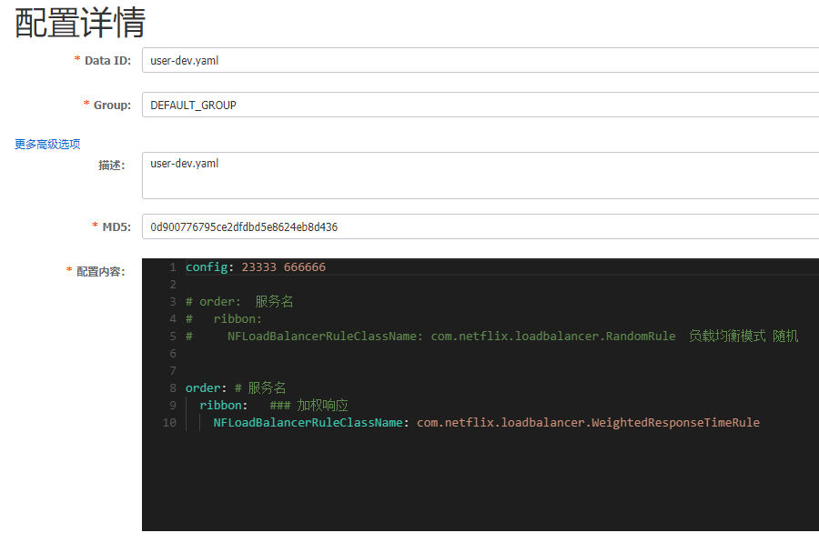
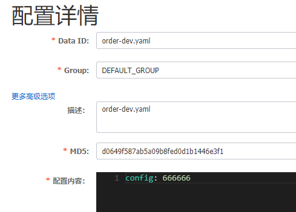
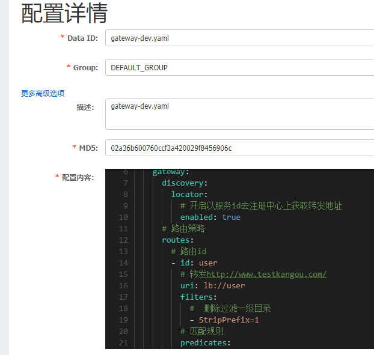
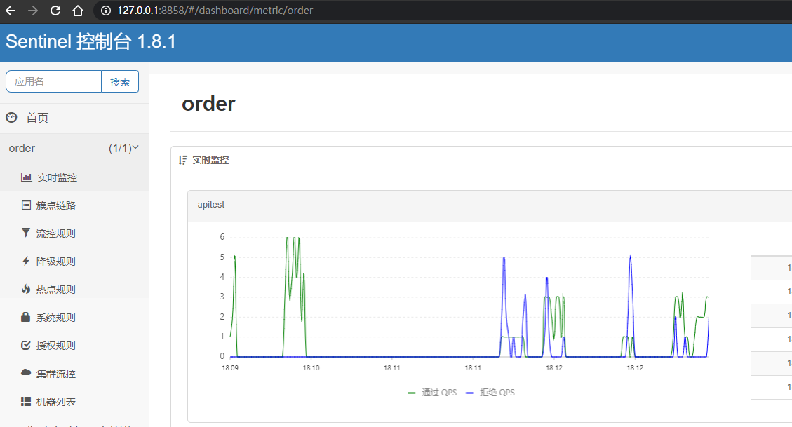

springcloud alibaba 2.2.0.RELEASE

整合 nacos openfeign 

实现了 远程调用 均衡负载 服务降级 注册发现 网关服务 sentinel限流

将要实现   网关 gateway filter（未测试） 和 global filter（未熟练使用）


nacos 配置中心


```yaml
server:
  port: 80
# 服务网关名称
spring:
  cloud:
    gateway:
      discovery:
        locator:
          # 开启以服务id去注册中心上获取转发地址
          enabled: true
      # 路由策略
      routes: 
        # 路由id
        - id: user
          # 转发http://www.testkangou.com/
          uri: lb://user
          filters:
            #  删除过滤一级目录
            - StripPrefix=1
          # 匹配规则
          predicates:
            - Path=/u/**
        # 路由id
        - id: order
          #  基于lb负载均衡形式转发到 服务
          uri: lb://order
          filters:
            #  删除过滤一级目录
            - StripPrefix=1
          # 匹配规则
          predicates:
            - Path=/o/**
```




> java -Dserver.port=8858 -Dcsp.sentinel.dashboard.server=localhost:8858 -Dproject.name=sentinel-dashboard -jar sentinel-dashboard-1.8.1.jar

> http://localhost:3041/sentinel/apitest?userId=123
> 
